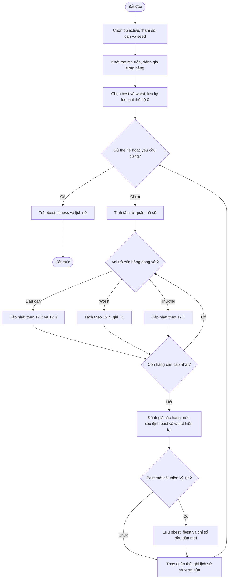

# Sơ đồ khối EHO

Luồng tương ứng Algorithm 11 và ba nhánh tường minh của Listings 12.1–12.2.

```mermaid
flowchart TD
    A([Bắt đầu]) --> B["Chọn objective, tham số, cận và seed"]
    B --> C["Khởi tạo ma trận, đánh giá từng hàng"]
    C --> D["Chọn best và worst, lưu kỷ lục, ghi thế hệ 0"]
    D --> E{"Đủ thế hệ hoặc yêu cầu dừng?"}
    E -- Có --> N["Trả pbest, fitness và lịch sử"]
    N --> O([Kết thúc])
    E -- Chưa --> F["Tính tâm từ quần thể cũ"]
    F --> G{"Vai trò của hàng đang xét?"}
    G -- Đầu đàn --> I["Cập nhật theo 12.2 và 12.3"]
    G -- Worst --> J["Tách theo 12.4, giữ +1"]
    G -- Thường --> H["Cập nhật theo 12.1"]
    I --> R{"Còn hàng cần cập nhật?"}
    J --> R
    H --> R
    R -- Có --> G
    R -- Hết --> K["Đánh giá các hàng mới, xác định best và worst hiện tại"]
    K --> Q{"Best mới cải thiện kỷ lục?"}
    Q -- Có --> L["Lưu pbest, fbest và chỉ số đầu đàn mới"]
    Q -- Chưa --> M["Thay quần thể, ghi lịch sử và vượt cận"]
    L --> M
    M --> E
```

Ở nút phân vai, hàng đầu đàn được ưu tiên nếu trùng với worst.
